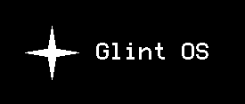

<div align="center">
  
  <br><br>
</div>

Glint OS is a bare-metal, 64-bit operating system kernel written in Rust (`#![no_std]`) and booted via the Limine bootloader. 

I built this project from scratch to learn the fundamentals of low-level systems engineering, x86_64 hardware architecture, bare-metal driver development, and hardware interrupt handling.


## Features

* **Bare-Metal Rust Kernel:** Operates without `std` or an underlying host operating system.
* **Custom VGA Framebuffer Driver:** Direct pixel manipulation and text rendering onto the Limine linear framebuffer.
* **Hardware-Timed Boot Animation:** Animated splash screen utilizing a 4-pointed star primitive with continuous RGB color interpolation powered by the PIT.
* **Interrupt-Driven Keyboard Input:** Custom IDT and PIC configuration handling asynchronous PS/2 keyboard scancodes.
* **8-Bit PC Speaker Synthesis:** Square-wave frequency generation using the Programmable Interval Timer (PIT) and I/O port `0x61`.
* **Hardware RTC Clock Decoding:** Reads live time directly from motherboard CMOS registers.
* **x86 CPUID Hardware Polling:** Inline assembly execution to query physical CPU vendor information.
* **Interactive Command Shell:** Modular command parser and REPL interface.

---

## Command Reference

| Command | Description |
| :--- | :--- |
| `clear` | Clears the framebuffer screen and redraws the header bar. |
| `echo <text>` | Prints the provided string to the display. |
| `time` | Reads and formats live UTC time from CMOS RTC registers. |
| `sysinfo` | Queries `cpuid` for hardware vendor strings and system uptime. |
| `play <notes>` | Plays custom frequencies or built-in audio templates (`mario`, `potter`, `shire`). |

---

## Project Architecture

```text
src/
├── arch/
│   ├── gdt.rs          # Global Descriptor Table setup
│   ├── interrupts.rs   # IDT, PIC, and hardware ISR handlers
│   └── time.rs         # Programmable Interval Timer (PIT) & sleep routines
├── drivers/
│   ├── vga.rs          # Framebuffer writer and color mapping
│   ├── rtc.rs          # CMOS Real-Time Clock parser
│   └── speaker.rs      # PC Speaker driver via I/O port 0x61
├── commands/           # Modular shell commands
├── shell.rs            # Keyboard scancode buffer & command REPL
├── splash.rs           # Hardware-timed animated boot screen
└── main.rs             # Kernel entry point & CPU halt loop

```

---

## Building and Running

I wrote PowerShell scripts to automate the build process, stage the Limine bootloader, and generate the final disk image. The repository includes the Limine configuration files inside the `disk_image` folder, while the compiled `.iso` files are ignored by git to prevent repository bloat.

### Prerequisites

* Rust Nightly toolchain (`rustup override set nightly`)
* `x86_64-unknown-none` target (`rustup target add x86_64-unknown-none`)
* `qemu-system-x86_64` installed and added to your system PATH

### Quick Start (Windows)

To compile the kernel, build the ISO, and immediately boot it in QEMU, run:

```powershell
.\buildandrun
```

### Build Scripts Breakdown

* `.\build.ps1` : Runs `cargo build`, copies the kernel binary to the `disk_image` directory, and packages everything into a bootable `glint_os.iso` using Limine.
* `.\run.ps1` : Launches the compiled ISO in QEMU with PC speaker audio mapped to the host audio device.

---

## What I Learned & Future Plans

Writing an OS from scratch forces you to handle failure states manually. Without an underlying operating system to catch runtime errors, bugs manifest as silent hardware freezes or rapid double and triple faults that immediately trigger a CPU reset. I had to learn how to set up x86_64 memory mapping, manage hardware state through PIC remapping, and write a custom panic handler to push crash telemetry out to QEMU's serial port.

While this project served as my introduction to bare-metal development, in the future, I plan to replace the remaining third-party abstractions with my own custom implementations. My next goals include writing a custom memory manager for dynamic heap allocation, building native bitmap font parsers to replace utility graphics crates, and eventually swapping out Limine for a completely custom x86_64 bootloader. Building every abstraction layer myself will be the final step to truly understanding the bare-metal boot process.
